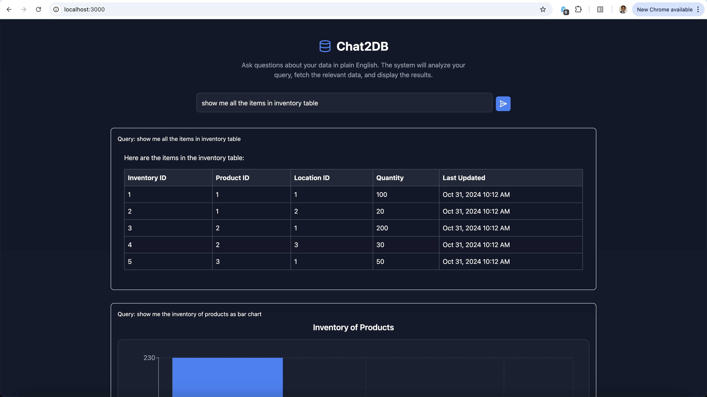
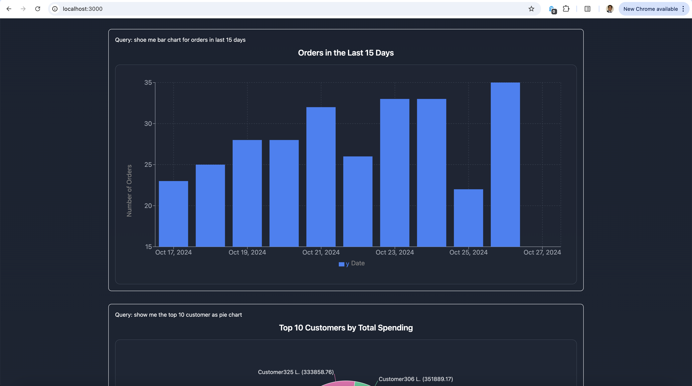
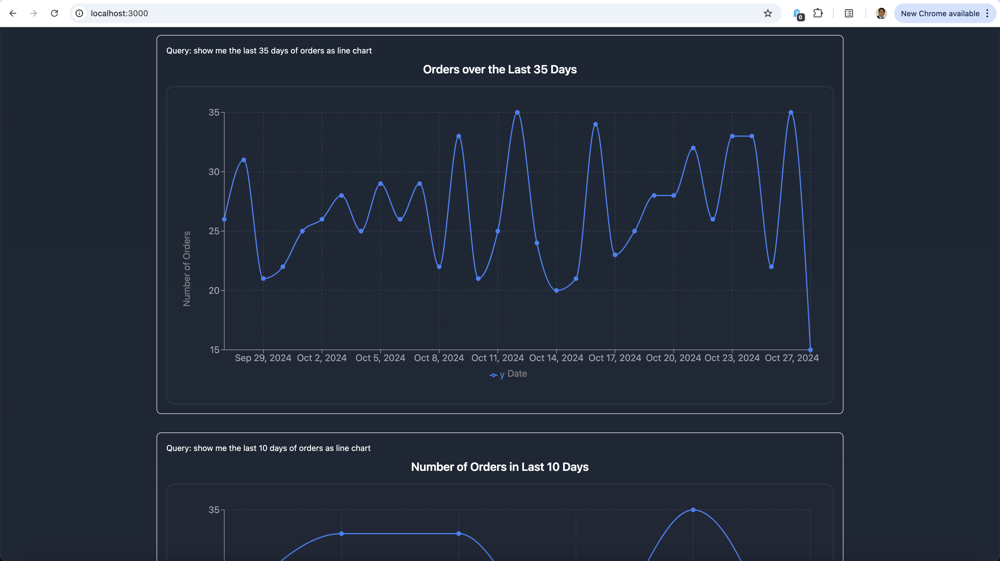
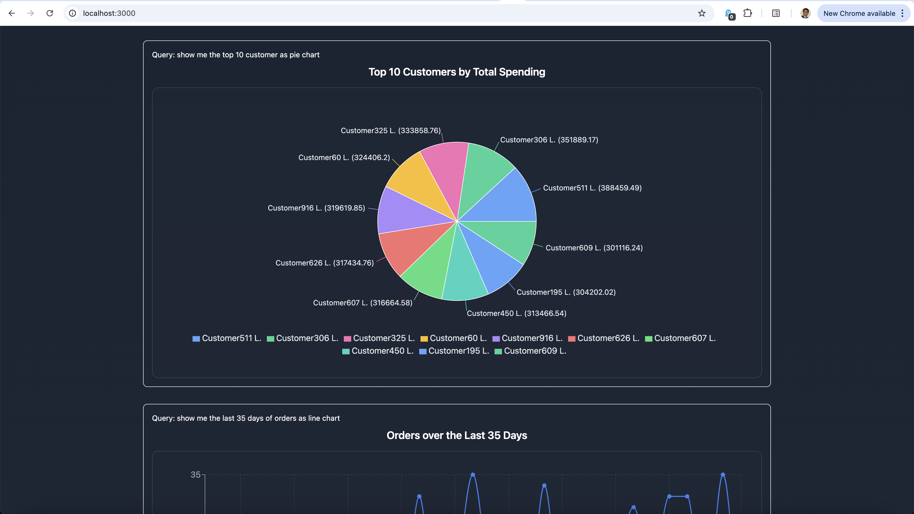
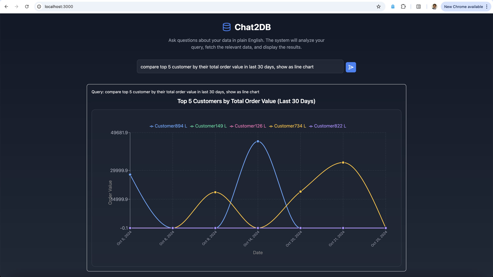

# Chat2DB - Natural Language Way to Query and Visualize Databases

A full-stack application that allows users to query a database using natural language and visualize the results through interactive charts.

## 🌟 Features

- Natural language queries to database
- Interactive data visualization using various chart types
- Real-time query processing
- Responsive UI with dark mode
- Support for multiple chart types (Bar, Line, Pie, Scatter)
- AI-powered query understanding and data analysis

## 🏗 Architecture

### Backend
- **FastAPI**: REST API framework
- **SQLAlchemy**: Database ORM
- **Phidata**: AI agent framework for natural language processing
- **PostgreSQL**: Database
- **Python 3.11+**: Programming language

### Frontend
- **Next.js 14**: React framework
- **TypeScript**: Type-safe JavaScript
- **Recharts**: Chart visualization
- **Tailwind CSS**: Styling
- **React Markdown**: Markdown rendering

## 🚀 Getting Started

### Prerequisites

- Docker and Docker Compose
- Node.js 18+
- Python 3.11+
- PostgreSQL (will be run in Docker)

### Environment Setup

1. Clone the repository: 
```
git clone https://github.com/gauravdhiman/chat2db.git
```

2. Install the Docker desktop and build the containers for first time.
```
docker compose up --build
```

For subsequent runs, you can start the containers without building them.
```
docker compose up
```

- #### IMP NOTE:
    - You can see in requirements.txt that we are installing phidata from a specific branch. This is temporary until [this PR](https://github.com/phidatahq/phidata/pull/1358) gets merged. Once this is merged, we will switch to the official phidata package.


3. Open the browser and navigate to http://localhost:3000.

### Screenshot
**Markdown output**


**Bar chart output**


**Line chart output**


**Pie chart output**


**Comparison chart output**


## 🧰 Tools
- [Docker](https://www.docker.com/) - Containerization
- [Node.js](https://nodejs.org/) - JavaScript runtime
- [Python](https://www.python.org/) - Programming language
- [PostgreSQL](https://www.postgresql.org/) - Database

## 📚 References
- [Phidata](https://phidata.com/) - AI agent framework
- [FastAPI](https://fastapi.tiangolo.com/) - REST API framework
- [Next.js](https://nextjs.org/) - React framework
- [Recharts](https://recharts.org/) - Chart visualization
- [Tailwind CSS](https://tailwindcss.com/) - Styling

## 📝 License
This project is not open source and is only for professional use. Any commercial without written permission is prohibited.
